# EDAF (Evaluator-Driven Agent Flow) - Self-Adapting System


A framework-agnostic system for AI-powered code generation with automatic quality gates.

---

## ⚠️ IMPORTANT: Installation Warning

**Before installing EDAF, create a separate branch!**

EDAF installation will create/overwrite the following files in your project:
- `.claude/CLAUDE.md` - Main configuration file for Claude Code
- `.claude/settings.json` - Claude Code settings with notification hooks
- `.claude/edaf-config.yml` - EDAF configuration
- `.claude/agents/*` - 32 agent files (2 core + 4 workers + 26 evaluators)
- `.claude/commands/setup.md` - Setup command
- `.claude/scripts/notification.sh` - Notification script
- `.claude/scripts/setup-mcp.sh` - MCP configuration script
- `.claude/sounds/*` - Sound files
- `.mcp.json` - MCP chrome-devtools configuration (auto-generated)

**Recommended workflow:**
```bash
# Create a new branch for EDAF installation
git checkout -b feature/edaf-setup

# Install EDAF (see Installation section below)
# ...

# Review changes and commit
git add .claude/
git commit -m "Add EDAF v1.0"

# Merge to main when ready
git checkout main
git merge feature/edaf-setup
```

**Why this matters:** If you already have custom `.claude/CLAUDE.md` or other Claude Code configurations, they will be overwritten. Using a separate branch lets you review changes before merging.

---

## 🎯 What is EDAF?

EDAF is a complete **4-Phase Software Development Framework** that:

1. **Phase 1**: Creates and evaluates design documents (1 Designer + 7 Evaluators)
2. **Phase 2**: Plans implementation tasks (1 Planner + 7 Evaluators)
3. **Phase 2.5**: Generates code using 4 specialized Worker Agents
4. **Phase 3**: Reviews code quality (7 Code Evaluators) + **UI/UX verification via MCP chrome-devtools**
5. **Phase 4**: Validates deployment readiness (5 Deployment Evaluators)
6. **Works with ANY language/framework** through self-adaptation
7. **🌐 Supports English & Japanese** with flexible language preferences
8. **🔍 Automatic visual verification** for frontend changes using browser automation

**Total:** 6 Agents + 26 Evaluators = Complete development automation

---

## 🔄 EDAF Flow Diagram

```mermaid
graph LR
    Start([💡 User Request]) --> Phase1[📐 Phase 1<br/>Design]
    Phase1 --> Phase2[📋 Phase 2<br/>Planning]
    Phase2 --> Phase3[⚙️ Phase 3<br/>Implementation]
    Phase3 --> Phase4[✅ Phase 4<br/>Deployment]
    Phase4 --> End([🚀 Production])

    style Start fill:#e3f2fd,stroke:#1976d2,stroke-width:2px
    style Phase1 fill:#fff3e0,stroke:#f57c00,stroke-width:3px
    style Phase2 fill:#f3e5f5,stroke:#7b1fa2,stroke-width:3px
    style Phase3 fill:#e8f5e9,stroke:#388e3c,stroke-width:3px
    style Phase4 fill:#fce4ec,stroke:#c2185b,stroke-width:3px
    style End fill:#c8e6c9,stroke:#2e7d32,stroke-width:2px
```



**Each phase includes:**
- **Phase 1**: Designer Agent + 7 Design Evaluators
- **Phase 2**: Planner Agent + 7 Planning Evaluators
- **Phase 3**: 4 Workers + 7 Code Evaluators + UI/UX Verification
- **Phase 4**: 5 Deployment Evaluators

---

### Key Innovations

#### 1. Flexible Language Support 🌐

**4 Language Options:**
- 🇬🇧 English docs + English output
- 🇯🇵 Japanese docs + Japanese output
- 🌐 English docs + Japanese output (learning mode)
- 📚 Dual language (EN + JA documentation saved separately)

**How it works:** Claude Code reads `.claude/CLAUDE.md` and automatically responds in your preferred language. No code changes needed!

---

## 🏗️ EDAF Architecture

### Phase 1: Design Gate
- **1 Designer Agent** - Creates comprehensive design documents
- **7 Design Evaluators** - Evaluate consistency, extensibility, goal-alignment, maintainability, observability, reliability, and reusability

### Phase 2: Planning Gate
- **1 Planner Agent** - Breaks down design into actionable tasks
- **7 Planning Evaluators** - Evaluate clarity, deliverable structure, dependencies, goal-alignment, granularity, responsibility alignment, and reusability

### Phase 3: Implementation & Code Review
- **4 Worker Agents** (Self-Adapting)
  - Database Worker - Any ORM (Sequelize, TypeORM, Prisma, Django ORM, SQLAlchemy, etc.)
  - Backend Worker - Any framework (Express, FastAPI, Spring Boot, Django, Flask, etc.)
  - Frontend Worker - Any frontend (React, Vue, Angular, Svelte, Solid, etc.)
  - Test Worker - Any testing framework (Jest, pytest, JUnit, Go test, RSpec, etc.)

- **7 Code Evaluators** - Evaluate quality, testing, security, documentation, maintainability, performance, and implementation alignment
- **UI/UX Verification** - Automatic visual verification via MCP chrome-devtools for frontend changes

### Phase 4: Deployment Gate
- **5 Deployment Evaluators** - Evaluate deployment readiness, production security, observability, performance benchmarks, and rollback procedures

**→ For detailed specifications, see `.claude/agents/` (including subdirectories for workers and evaluators)**

---

## 🚀 Quick Start

### Prerequisites

- Claude Code CLI installed
- Git repository initialized
- Project with code to evaluate
- Node.js (any version manager: nvm, nodenv, asdf, volta, mise, or Homebrew)

### Environment Support

| Environment | Status | UI Verification |
|-------------|--------|-----------------|
| **macOS** | ✅ Full | ✅ Automatic |
| **Windows** | ✅ Full | ✅ Automatic |
| **Linux** | ✅ Full | ✅ Automatic |
| **WSL2** | ⚠️ Limited | ❌ Skipped |

> **WSL2 Note:** MCP chrome-devtools cannot access Windows Chrome from WSL2. UI verification is automatically skipped, and manual verification is recommended.

### Installation (6 steps!)

```bash
# 1. Clone to your project directory
cd /path/to/your/project
git clone https://github.com/Tsuchiya2/evaluator-driven-agent-flow.git

# 2. Run installation script
bash evaluator-driven-agent-flow/scripts/install.sh

# 3. Restart Claude Code (IMPORTANT!)
# Exit if Claude Code is already running, then restart:
claude           # Start Claude Code

# 4. Run interactive setup
/setup           # Inside Claude Code - interactive setup wizard

# 5. Restart Claude Code again (IMPORTANT!)
# Exit and restart to load CLAUDE.md generated by /setup:
claude           # Start Claude Code

# 6. (Optional) Remove installation directory
rm -rf evaluator-driven-agent-flow
```

**⚠️ IMPORTANT**:
- You MUST restart Claude Code after running `install.sh` for the `/setup` command to be recognized. Claude Code only loads slash commands on startup.
- You MUST restart Claude Code again after running `/setup` for the generated `.claude/CLAUDE.md` configuration to take effect. Claude Code only loads CLAUDE.md on startup.

That's it! The installation script will:
- ✅ Install 2 Core Agents to `.claude/agents/`
- ✅ Install 4 Worker Agents to `.claude/agents/workers/`
- ✅ Install 26 Evaluators to `.claude/agents/evaluators/` (organized by phase)
- ✅ Install `/setup` command to `.claude/commands/`
- ✅ Configure MCP chrome-devtools (auto-detects npx/bunx path)
- ✅ Copy configuration template (optional)
- ✅ Copy documentation (optional)

### Interactive Setup with `/setup` ⚠️ CRITICAL!

**IMPORTANT**: The `/setup` command configures EDAF in `.claude/CLAUDE.md`. Without this, Claude Code will NOT use the agent flow properly!

The interactive setup wizard will guide you through:

1. **Language Preferences 🌐** - Choose documentation and output language (EN/JA)
2. **Docker Detection 🐳** - Automatically detects and configures Docker environments
3. **Sound Notifications 🔔** - Configure task completion alerts
4. **MCP chrome-devtools 🌐** - Set up UI/UX verification ([Guide](docs/UI-VERIFICATION-GUIDE.md))
5. **Auto-Detection** - Detects your language, framework, ORM, and tools
6. **Component Testing** - Verifies workers and evaluators are ready

**Supported languages/frameworks:** TypeScript, JavaScript, Python, Java, Go, Rust, Ruby, PHP, and their popular frameworks.

**To change settings:** Simply run `/setup` again!

---

## 🚀 How to Use EDAF

After running `/setup`, you can use EDAF in two ways:

### Method 1: Full 4-Phase Gate System (Recommended)

Use this when you want complete quality assurance with design, planning, implementation, and review:

```bash
# Inside Claude Code
"エージェントフローに沿ってユーザー認証機能を実装してください"
# or
"Implement user authentication feature using EDAF"
```

**What happens:**
1. **Phase 1**: Designer creates design document → 7 design evaluators review it
2. **Phase 2**: Planner creates task breakdown → 7 planner evaluators review it
3. **Phase 2.5**: Workers implement code (database, backend, frontend, tests)
4. **Phase 3**: 7 code evaluators review implementation + **UI/UX verification via chrome-devtools (if frontend changed)**
5. **Phase 4** (optional): 5 deployment evaluators check production readiness

**Result:** High-quality, well-designed, thoroughly tested code with visual verification and automatic notifications at each phase.

### Method 2: Workers Only (Quick Implementation)

Use this when you already have a clear design and just need code generation:

```bash
# Inside Claude Code
"database-workerを使ってUserモデルを作成してください"
# or
"Use backend-worker to create user authentication API"
```

**What happens:**
- Specific worker generates code based on your requirements
- Self-adapts to your language/framework
- No evaluators run (faster, but less quality assurance)

**When to use each method:**
- **Full EDAF**: New features, complex changes, production code
- **Workers Only**: Quick prototypes, minor updates, experimental code

### Example Trigger Phrases

**Workers:**
- Database Worker: `"Create a User model with email and password"`
- Backend Worker: `"Generate REST API for User CRUD"`
- Frontend Worker: `"Build a login form component"`
- Test Worker: `"Write unit tests for UserService"`

**Evaluators:**
- `"Evaluate code quality of src/services/user.ts"`
- `"Check security vulnerabilities in authentication"`

---

## 📊 Supported Technologies

### Languages (11)

✅ TypeScript
✅ JavaScript
✅ Python
✅ Java
✅ Go
✅ Rust
✅ Ruby
✅ PHP
✅ C#
✅ Kotlin
✅ Swift

### Frameworks (50+)

**Backend**: Express, FastAPI, Spring Boot, Gin, Django, Flask, NestJS, Fastify, Koa, Rails, Laravel, ASP.NET

**Frontend**: React, Vue, Angular, Svelte, Solid, Next.js, Nuxt, SvelteKit

**ORM**: Sequelize, TypeORM, Prisma, Django ORM, SQLAlchemy, Hibernate, GORM, Diesel, ActiveRecord, Eloquent

**Testing**: Jest, Vitest, pytest, JUnit, Go test, Rust test, RSpec, PHPUnit, Mocha, Playwright, Cypress

---

## 🔧 How Self-Adaptation Works

EDAF automatically adapts to your project using a **3-Layer Detection System**:

```
Layer 1: Automatic Detection
  ├─ Read package.json/requirements.txt/go.mod/etc.
  ├─ Detect language, framework, ORM, tools
  └─ Find existing code patterns
     ↓
Layer 2: Configuration File (if needed)
  ├─ Read .claude/edaf-config.yml
  └─ Use explicit configuration
     ↓
Layer 3: User Questions (fallback)
  └─ Ask via interactive prompts
```

**Result:** No templates needed - works with any language/framework.

---

## 📋 Configuration (Optional)

EDAF auto-detects your project settings via `/setup`. For manual configuration, see `.claude/edaf-config.example.yml`.

---

## 🔍 What Gets Evaluated

EDAF evaluates 7 key aspects of your code: **Quality**, **Testing**, **Security**, **Documentation**, **Maintainability**, **Performance**, and **Implementation Alignment**.

**→ For detailed evaluation criteria, see the evaluator specifications in `.claude/evaluators/`**

---

## 📚 Documentation

- **Core Agents**: `.claude/agents/`
  - `designer.md` (Phase 1)
  - `planner.md` (Phase 2)

- **Worker Agents**: `.claude/agents/workers/`
  - `database-worker-v1-self-adapting.md`
  - `backend-worker-v1-self-adapting.md`
  - `frontend-worker-v1-self-adapting.md`
  - `test-worker-v1-self-adapting.md`

- **Evaluators**: `.claude/agents/evaluators/`
  - `phase1-design/` - 7 Design Evaluators
  - `phase2-planner/` - 7 Planner Evaluators
  - `phase3-code/` - 7 Code Evaluators
  - `phase4-deployment/` - 5 Deployment Evaluators

---

## 🤝 Contributing

Contributions are welcome! To add support for a new language/framework:

1. Add tool detection patterns to relevant evaluator/worker
2. Test with real project
3. Submit PR with examples

**No new templates needed** - just update detection logic!

---

## 📄 License

MIT License - see [LICENSE](LICENSE) file

---

## 🙏 Acknowledgments

Built with [Claude Code](https://claude.com/claude-code) by Anthropic.

---

## 🎵 Sound Assets Attribution

EDAF uses the following sound files for notifications:

### cat-meowing.mp3
- **Source**: [Chosic](https://www.chosic.com/download-audio/54581/)
- **License**: CC0 (Public Domain)
- **Description**: Cat meowing sound for error notifications and attention alerts

### bird_song_robin.mp3
- **Source**: [BigSoundBank - European Robin Single Call](https://bigsoundbank.com/robin-1-s1667.html)
- **License**: Free for personal and commercial use with attribution
- **Description**: European Robin bird song for task completion notifications

**Note**: All sound files are located in `.claude/sounds/` and are used in accordance with their respective licenses.

---

## 📧 Support

For issues, questions, or feedback:
- Open an issue on GitHub
- Read the documentation in `.claude/` directory

---

**Status**: ✅ Production Ready
**Maintained**: Yes
**Last Updated**: 2025-11-10
